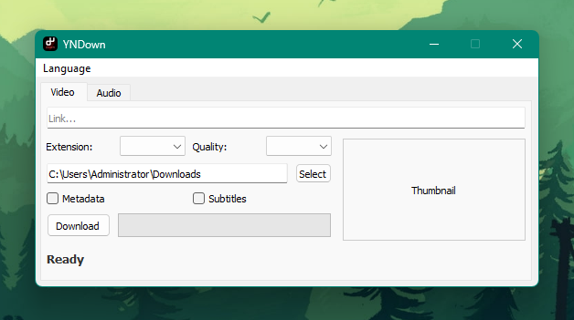
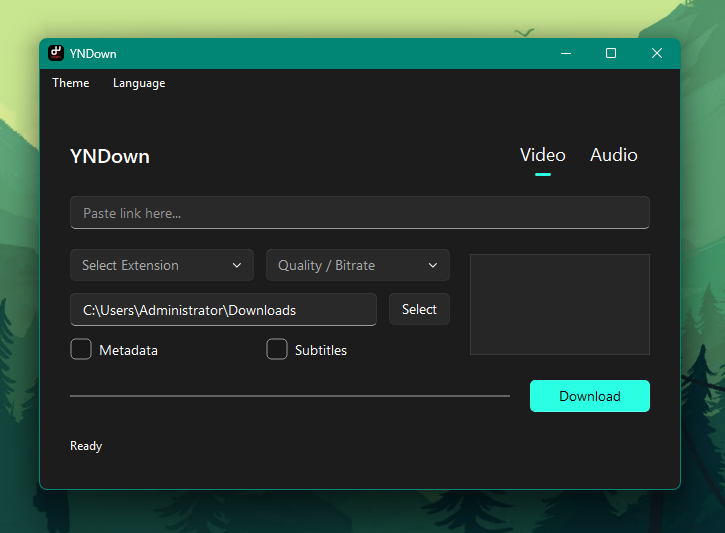

# YNDown

A desktop YouTube downloader built with PyQt5 and yt-dlp.





## What it does

YNDown lets you download videos and audio tracks from YouTube by pasting a link. It fetches metadata automatically, shows a thumbnail preview, and lets you choose the format and quality before downloading.

## Requirements

- Python 3.10 or later
- PyQt5
- yt-dlp
- requests
- ffmpeg (place `ffmpeg.exe` in the same directory for audio extraction and subtitle embedding)

```
pip install PyQt5 yt-dlp requests
```

For the Fluent UI version (`win.py`):

```
pip install pyqt-fluent-widgets
```

## Running

```
python main.py
```

On Windows, `win.py` is recommended instead. It uses PyQt-Fluent-Widgets for a native Windows 11 look with automatic theme and accent color detection.

```
python win.py
```

## Features

- Video download with selectable resolution and container format (mp4, mkv, webm, flv)
- Audio download with selectable codec and bitrate (mp3, m4a, wav, opus, aac)
- Thumbnail preview loaded from the video metadata
- Metadata embedding via FFmpegMetadata postprocessor
- Subtitle embedding for video downloads
- Output directory persisted between sessions
- Interface available in Turkish, English, French, Spanish, Italian and Russian
- Language preference saved between sessions

The `win.py` version additionally supports:

- Automatic Windows system theme detection (light / dark / auto)
- Theme preference saved between sessions
- Windows accent color applied automatically

## Notes

- `ffmpeg.exe` must be in the same directory as the script or on the system PATH for audio extraction and subtitle embedding to work.
- Only YouTube URLs are currently handled for metadata fetching, but yt-dlp itself supports many other sites.
